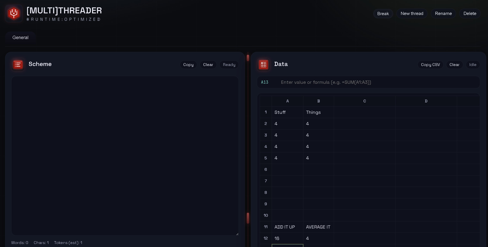

# Multithreader
[MULTI]THREADER #Runtime:Optimized. A dark, dual-panel journal + data sheet for taskmaxing.

## What it does
- Scheme panel: plain text journal with formatting stripped on paste.
- Data panel: lightweight spreadsheet with formulas, sorting, shading, alignment, and multi-select.
- Threads: tabbed ideas with rename, reorder, and context menu actions.
- Exports: TXT, CSV, ZIP, or PDF.
- Autosave local only, with optional cache file in a user-selected location.
- Break timer, find/replace, and keyboard shortcuts.

## Quick start
1. Open `index.html` in a modern Chromium-based browser (Edge or Chrome).
2. Optional: run a local server for full file access features (cache file location, open folder).
   `python -m http.server` then open `http://localhost:8000`.
3. Use Page options to set/view/clear the cache.

## Keyboard shortcuts
- `A` all panels, `S` scheme only, `D` data only, `X` swap, `Z` zen.
- `F` or `Ctrl+F` open find/replace (toggle).
- `N` new thread.
- `Ctrl+Z` undo (scheme or sheet cell edit).
- `Ctrl+O` import CSV into the data sheet.

## Data and privacy
- All storage stays local (browser storage plus optional cache file).
- Nothing is sent to a server.

## Exports
- Scheme: TXT.
- Data: CSV.
- Both: ZIP or PDF.
